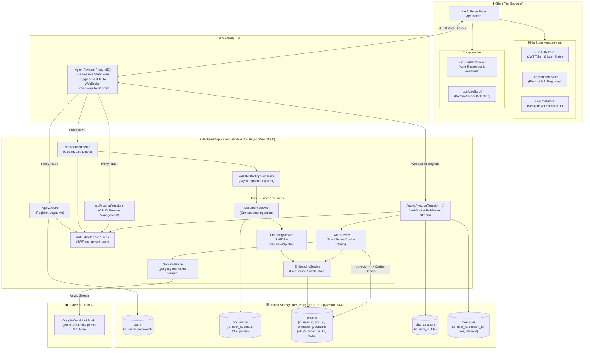
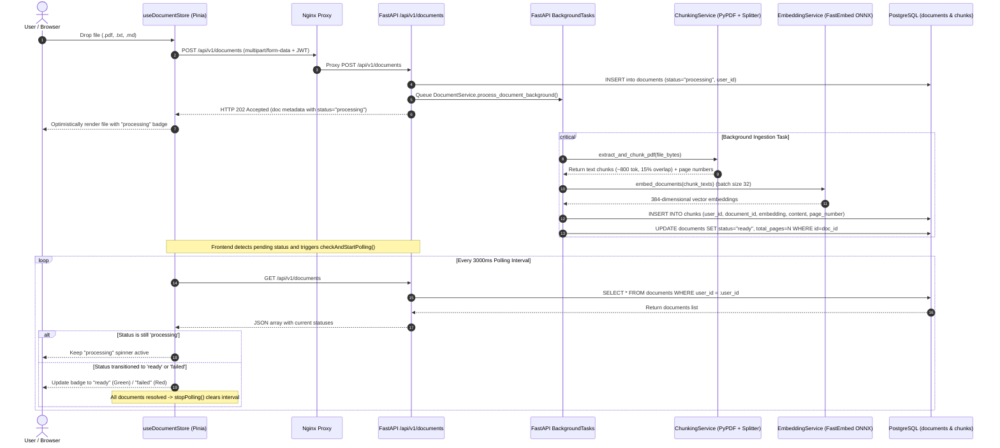
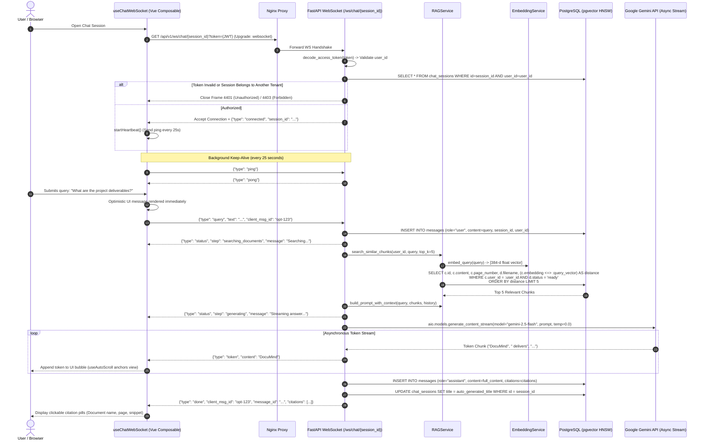
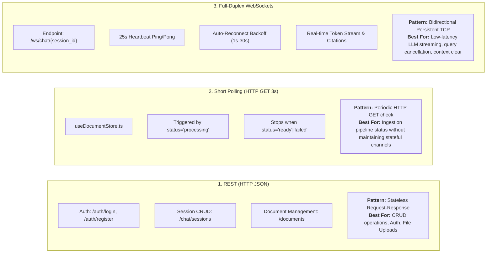

# DocuMind: Complete Application Architecture & Design Blueprint

DocuMind is an enterprise-grade, multi-tenant Document Q&A system designed for strict data isolation, fast local vector retrieval, and low-latency token streaming.

---

## 🛠️ Technology Stack & Tools Used

| Layer | Tool / Technology | Version / Spec | Purpose & Implementation |
| :--- | :--- | :--- | :--- |
| **Frontend UI** | **Vue 3** + **Vite** + **TypeScript** | Vue 3.5+, Vite 6+ | Reactive SPA with `<script setup>`, strict typing, and composables |
| **State Management** | **Pinia** | Pinia 2.3+ | Centralized reactive stores: `auth.ts`, `document.ts`, `chat.ts` |
| **Styling & Icons** | **Tailwind CSS** + **Lucide Icons** | Tailwind v4, Lucide Vue | Modern responsive dark/light UI, modal overlays, dropzones |
| **Reverse Proxy** | **Nginx** | Alpine | Serves static SPA bundle, proxies `/api/` to backend, handles HTTP → WebSocket upgrade headers |
| **Backend Framework** | **FastAPI** (Python 3.10+) | Uvicorn / Async ASGI | Async REST endpoints, background tasks, native WebSocket routes |
| **ORM & Database Driver** | **SQLAlchemy 2.0** + **asyncpg** | Async engine + Sessions | Fully asynchronous database queries, relational mapping, connection pooling |
| **Relational & Vector DB** | **PostgreSQL 16** + **pgvector** | `pgvector/pgvector:pg16` | Unified relational storage + HNSW cosine vector index (`vector(384)`) |
| **Local Embeddings** | **FastEmbed** | `BAAI/bge-small-en-v1.5` | 384-dimensional local ONNX embedding inference (zero external latency) |
| **Document Processing** | **PyPDF** + **LangChain Text Splitters** | `RecursiveCharacterTextSplitter` | PDF page extraction, ~800 tokens (3200 chars) chunks with 15% overlap |
| **LLM Inference** | **Google GenAI Async SDK** | `google-genai` (Gemini 2.5/3.6 Flash) | Low-temperature (0.0) streaming RAG answer generation with strict document grounding |
| **Authentication** | **PyJWT** + **Passlib** | HMAC-SHA256 (HS256) + bcrypt | Stateless bearer JWT token authentication & WebSocket query token handshake |
| **Containerization** | **Docker** & **Docker Compose** | Multi-container compose | Orchestration of `postgres`, `backend`, and `frontend` services |

---

## 🏛️ Diagram 1: System Component & Layered Architecture

This high-level architecture diagram illustrates the end-to-end topology, showing how traffic flows from the browser through Nginx, FastAPI, the local FastEmbed engine, the PostgreSQL/pgvector database, and the external Gemini LLM.



---

## 🔄 Diagram 2: Document Ingestion Pipeline & Short Polling Design

The application uses **HTTP Short Polling (3-second interval)** for document status tracking. Here is how document ingestion, async background chunking, embedding generation, and status updates work:



### 🔍 How Document Polling Works in Code:
1. Located in `frontend/src/stores/document.ts`.
2. When `fetchDocuments()` or `uploadFile()` executes, `checkAndStartPolling()` checks `documents.value.some(d => d.status === 'uploading' || d.status === 'processing')`.
3. If pending files exist, `setInterval` triggers `documentService.listDocuments()` every **3000ms**.
4. Once all documents transition to `'ready'` or `'failed'`, `clearInterval` is called to halt background network requests.

---

## ⚡ Diagram 3: Real-Time RAG & WebSocket Streaming Architecture

The chat interface uses **Full-Duplex WebSockets (`/api/v1/ws/chat/{session_id}`)** for bidirectional streaming, tenant-scoped vector search, token generation, and ping/pong heartbeats.



---

## ⚖️ Deep Dive: Interaction Designs & Protocols Compared

DocuMind uses three distinct communication patterns strategically chosen for specific operational requirements:



### 1. WebSocket Protocol & Framing Specification
Implemented in `backend/src/api/v1/websocket.py` and `frontend/src/composables/useChatWebSocket.ts`:

| Direction | Frame Type | Payload Schema | Action / Purpose |
| :--- | :--- | :--- | :--- |
| **Client → Server** | `query` | `{"type": "query", "text": "...", "client_msg_id": "opt-123"}` | Submits user prompt to initiate vector search and streaming. |
| **Client → Server** | `ping` | `{"type": "ping"}` | Sent every 25s to keep WebSocket connections open through proxies. |
| **Client → Server** | `clear_context` | `{"type": "clear_context"}` | Resets short-term conversation context for the active session. |
| **Client → Server** | `cancel` | `{"type": "cancel"}` | Aborts ongoing LLM generation stream. |
| **Server → Client** | `connected` | `{"type": "connected", "session_id": "...", "user_id": "..."}` | Acknowledges successful JWT auth and session ownership. |
| **Server → Client** | `pong` | `{"type": "pong"}` | Heartbeat response. |
| **Server → Client** | `status` | `{"type": "status", "step": "searching_documents"\|"generating", "message": "..."}` | Provides real-time phase updates to the UI. |
| **Server → Client** | `token` | `{"type": "token", "content": "string"}` | Streamed individual word/subword token from Gemini. |
| **Server → Client** | `done` | `{"type": "done", "client_msg_id": "...", "content": "...", "citations": [...]}` | Signals completion, persists message ID, and delivers citation metadata. |
| **Server → Client** | `error` | `{"type": "error", "message": "..."}` | Delivers user-facing error details if generation or search fails. |

### 2. Auto-Reconnect & Resilience Strategy
- **Exponential Backoff**: If disconnected unexpectedly (`event.code !== 1000`), `useChatWebSocket.ts` calculates backoff:
  `Delay = min(1000 * 2^(attempt - 1), 30000) ms`
  *(Attempts reconnect after 1s, 2s, 4s, 8s, 16s, up to max 30s, capped at 5 attempts).*
- **Auto-scroll Protection**: `useAutoScroll.ts` monitors scroll offset: auto-scroll is maintained as long as the user is anchored to the bottom, but automatically suspends if the user scrolls up to review previous citation sources.

---

## 🔒 Multi-Tenant Data Isolation Invariant

Every database model incorporates strict row-level tenant foreign keys (`user_id UUID REFERENCES users(id) ON DELETE CASCADE`):

```sql
-- Enforced in RAGService.search_similar_chunks()
SELECT 
    c.id, 
    c.document_id, 
    d.filename, 
    c.page_number, 
    c.content,
    (c.embedding <=> :query_vector) AS distance
FROM chunks c
JOIN documents d ON d.id = c.document_id
WHERE c.user_id = :authenticated_user_id
  AND d.user_id = :authenticated_user_id
  AND d.status = 'ready'
ORDER BY distance ASC
LIMIT 5;
```

This guarantees that even with billions of embedded chunks in the shared `pgvector` HNSW index, **zero cross-tenant data leakage** is mathematically possible. Attempting to query an ID belonging to another user results in an immediate `404 Not Found`.
