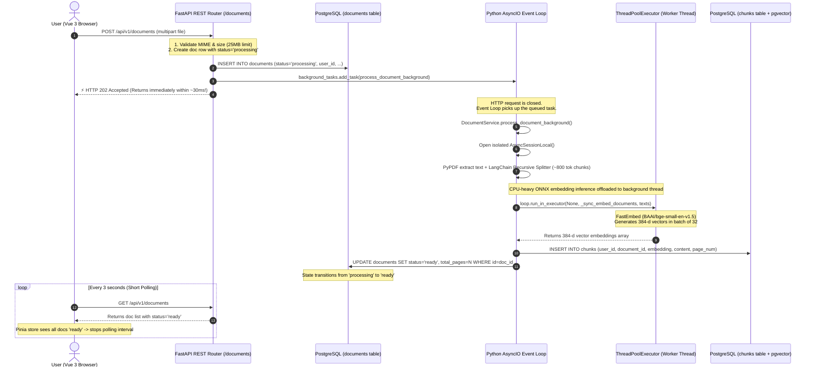
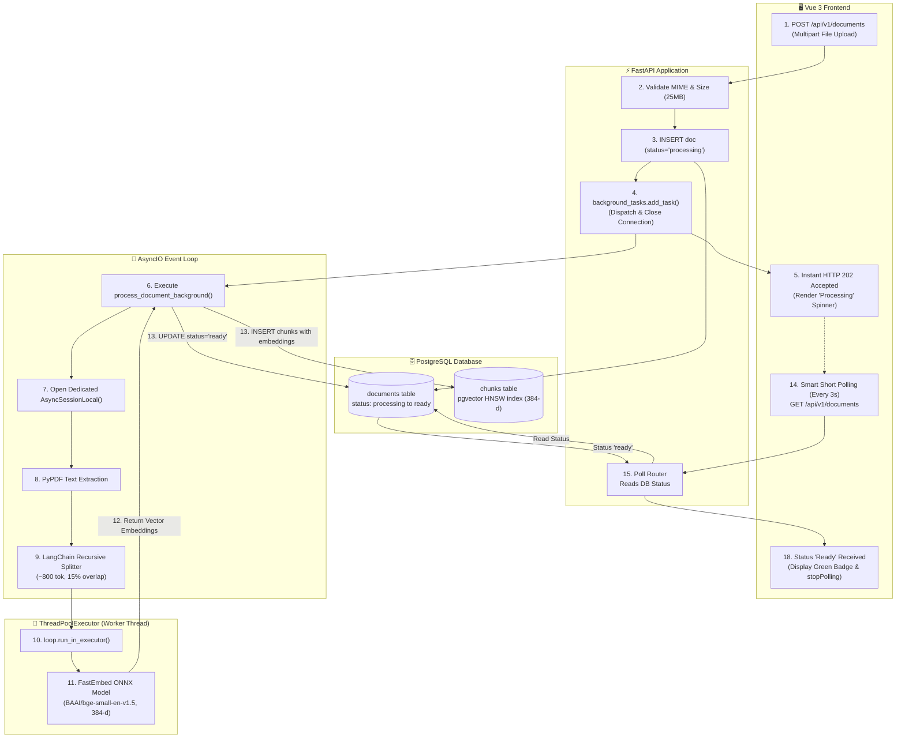

# DocuMind Asynchronous Ingestion Engine Workflow

This document provides a comprehensive, step-by-step breakdown of how DocuMind's asynchronous ingestion engine processes document uploads across the frontend, FastAPI backend, AsyncIO event loop, thread pool, and PostgreSQL database.

---

## ⚡ 1. Asynchronous Ingestion Sequence Diagram



---

## 📐 2. Architectural & Data Flow Diagram



---

## 🔬 3. Deep Dive: 5 Critical Asynchronous Mechanisms

### 1. Immediate HTTP 202 Accepted & BackgroundTasks
When the user submits a file, the REST router in FastAPI does not process the document inline. Instead:
* It creates an initial row in the `documents` table marked as `status = "processing"`.
* It queues the ingestion job with `background_tasks.add_task(...)`.
* It returns an **HTTP 202 ACCEPTED** status code to the client in ~30ms, closing the client connection quickly.

```python
# backend/src/api/v1/documents.py (Lines 59-69)
background_tasks.add_task(
    DocumentService.process_document_background,
    document_id=doc.id,
    user_id=current_user.id,
    file_bytes=file_bytes,
    filename=filename,
    mime_type=mime_type
)

return doc  # Returns immediately to browser!
```

### 2. Isolated Database Session Lifecycle
Because the original HTTP request finishes and closes its request-scoped DB session, the background task cannot reuse the request's connection. It instantiates an independent session context:

```python
# backend/src/services/document_service.py (Lines 79-80)
@classmethod
async def process_document_background(cls, document_id, user_id, file_bytes, filename, mime_type):
    async with AsyncSessionLocal() as session:  # Fresh, dedicated async DB session
        ...
```

### 3. Non-Blocking CPU Offloading (`run_in_executor`)
Computing vector embeddings using ONNX/neural network models (`FastEmbed`) is a CPU-bound, synchronous operation. If executed directly inside an `async def` function on Python's main event loop, it would block the entire server—preventing FastAPI from serving other users or streaming WebSocket tokens.

The system solves this by offloading embedding inference to a separate worker thread using `loop.run_in_executor`:

```python
# backend/src/services/embedding_service.py (Lines 43-46)
async def embed_documents(self, texts: List[str]) -> List[List[float]]:
    loop = asyncio.get_running_loop()
    # Runs the synchronous ONNX batch inference in a background thread pool!
    return await loop.run_in_executor(None, self._sync_embed_documents, texts)
```
> **Why this matters:** The main asyncio event loop remains 100% free to handle WebSocket chats and API requests while the embedding calculation runs in parallel.

### 4. Background Parsing & Vector Index Ingestion
Inside the worker execution lifecycle:
1. **Extraction:** `PyPDF` extracts text per page (preserving page numbers for citations).
2. **Chunking:** Slices text into ~800 token fragments with a 15% overlap using a recursive strategy.
3. **Batch Vector Insert:** Embeddings and chunk metadata are inserted into the `chunks` table (indexed with pgvector HNSW).
4. **State Transition:** The document status is updated to `ready` (if successful) or `failed` (if an exception occurs).

### 5. Frontend State Synchronization (Smart Short Polling)
On the browser side, the frontend synchronizes the UI without needing heavy persistent connections for simple document uploads:
1. As soon as the upload returns with status `"processing"`, the UI displays a processing spinner.
2. `checkAndStartPolling()` initiates a 3-second interval timer (`setInterval(..., 3000)`).
3. Every 3 seconds, `documentService.listDocuments()` polls the server.
4. As soon as the background task completes and updates the database row to `"ready"`, the frontend receives `"ready"`, displays the green badge, and calls `stopPolling()` to terminate the timer.

---

## 🎯 4. Summary of Benefits

| Aspect | Synchronous Approach (Naive) | DocuMind Asynchronous Approach |
| :--- | :--- | :--- |
| **HTTP Response Time** | 5 – 20 seconds (user waits) | **< 30 milliseconds** |
| **Server Concurrency** | Blocks event loop during ONNX math | **Non-blocking** via `run_in_executor` thread pool |
| **User Experience** | Frozen UI / spinning page | **Instant optimistic update** + live status badge |
| **Failure Isolation** | Failed parsing crashes HTTP request | **Handled gracefully** in background with DB error status |
