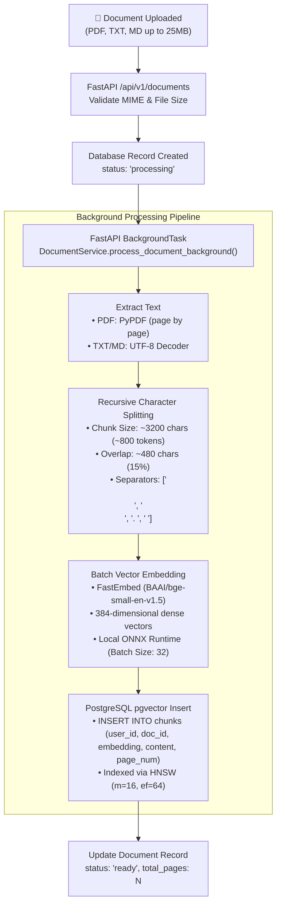
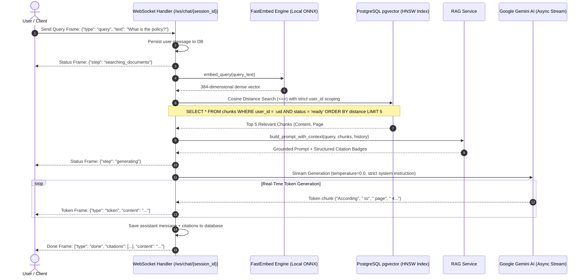

# DocuMind — Clean RAG Architecture & Pipeline Specification

DocuMind implements a high-performance, strictly grounded **Retrieval-Augmented Generation (RAG)** pipeline designed for multi-tenant data privacy, zero-latency local embeddings, and streaming LLM inference.

---

## 🧭 High-Level Unified Architecture

```mermaid
flowchart LR
    subgraph Ingestion ["1. Ingestion Pipeline"]
        direction TB
        Doc["📄 Upload File<br/>(.pdf, .txt, .md)"] --> API["FastAPI Endpoint<br/>POST /api/v1/documents"]
        API --> Parser["PyPDF Text Extractor<br/>+ Sanitizer"]
        Parser --> Chunker["Recursive Splitter<br/>(800 tok / 15% overlap)"]
        Chunker --> Embedder["FastEmbed ONNX<br/>(BAAI/bge-small-en-v1.5)"]
    end

    subgraph Storage ["2. Unified Multi-Tenant Storage"]
        direction TB
        DB[("PostgreSQL 16 + pgvector<br/>━━━━━━━━━━━━━━━━━━<br/>• Table: documents (user_id FK)<br/>• Table: chunks (user_id FK)<br/>• Index: HNSW Cosine (384-d)")]
    end

    subgraph Retrieval ["3. Retrieval & Generation Pipeline"]
        direction TB
        Query["💬 User Query<br/>(WebSocket Stream)"] --> QEmbed["FastEmbed ONNX<br/>(Query Vector 384-d)"]
        QEmbed --> VSearch["pgvector Cosine Search<br/>(Strict user_id Filter, Top 5)"]
        VSearch --> Context["Prompt & Citation<br/>Builder"]
        Context --> LLM["Google Gemini Flash<br/>(Strict Grounding, temp=0.0)"]
        LLM --> Stream["⚡ Real-Time Token Stream<br/>+ Verified Citations"]
    end

    Embedder -->|Store Chunks & Embeddings| DB
    VSearch <-->|Cosine Distance (<=>)| DB
```

---

## 📥 1. Document Ingestion Pipeline

When a user uploads a document, FastAPI processes the file asynchronously in the background using local ONNX embedding models to prevent network latency.



### Ingestion Specifications
- **Chunking Strategy**: `RecursiveCharacterTextSplitter` splitting on paragraph and sentence boundaries.
- **Chunk Parameters**: 800 tokens target (~3,200 characters), 15% overlap (~480 characters) to preserve context continuity across chunk borders.
- **Embedding Engine**: Local ONNX Runtime via `FastEmbed` (`BAAI/bge-small-en-v1.5`, 384-dimensional dense embeddings).
- **Indexing**: PostgreSQL `pgvector` HNSW (Hierarchical Navigable Small World) index with `vector_cosine_ops`.

---

## 🔍 2. Real-Time Retrieval & Grounded Generation

The retrieval workflow operates over full-duplex WebSockets, performing sub-millisecond vector similarity search scoped strictly to the current authenticated tenant before streaming tokens from Gemini.



---

## 🔒 3. Tenant Isolation & Vector Query Pattern

Data isolation is enforced at the database query level. Vector similarity search is restricted by `user_id` before similarity rankings are evaluated:

```sql
SELECT 
    c.id AS chunk_id,
    c.document_id,
    d.filename AS document_name,
    c.page_number,
    c.content,
    (c.embedding <=> :query_vector) AS distance
FROM chunks c
JOIN documents d ON d.id = c.document_id
WHERE c.user_id = :authenticated_user_id
  AND d.user_id = :authenticated_user_id
  AND d.status = 'ready'
ORDER BY distance ASC
LIMIT 5;
```

---

## 🤖 4. Grounding & Anti-Hallucination Prompt Design

DocuMind uses a deterministic zero-temperature prompt that forbids external knowledge:

```text
You are DocuMind AI, a strict and secure document reference assistant. Your sole responsibility is to answer user queries using EXCLUSIVELY the provided document excerpts below.

STRICT GROUNDING RULES:
1. Ground every claim directly and factually in the provided Context excerpts.
2. If the provided excerpts do NOT contain the answer, you MUST state exactly:
   "I cannot find this information in your uploaded documents."
3. Do NOT use external general knowledge, guess, or hallucinate facts not present in the context.
4. If a question is general chit-chat, politely reply that you can only answer questions about the user's uploaded documents.
5. Format your answers clearly with concise markdown paragraphs or bullet points.
```

---

## 📊 5. Pipeline Summary Comparison

| Component | Ingestion Stage | Retrieval Stage |
| :--- | :--- | :--- |
| **Input** | PDF, TXT, MD binary upload | User chat query via WebSocket |
| **Processing** | Async `BackgroundTasks` | Real-time async event loop |
| **Model** | FastEmbed `BAAI/bge-small-en-v1.5` | FastEmbed `BAAI/bge-small-en-v1.5` |
| **Vector Dimension** | 384-dimensional dense vector | 384-dimensional dense vector |
| **Storage / Search** | HNSW Index write (`m=16, ef=64`) | Cosine distance search (`<=>`, top 5) |
| **Output** | Stored vector chunks + 'ready' status | Streamed Gemini tokens + Citation pills |
