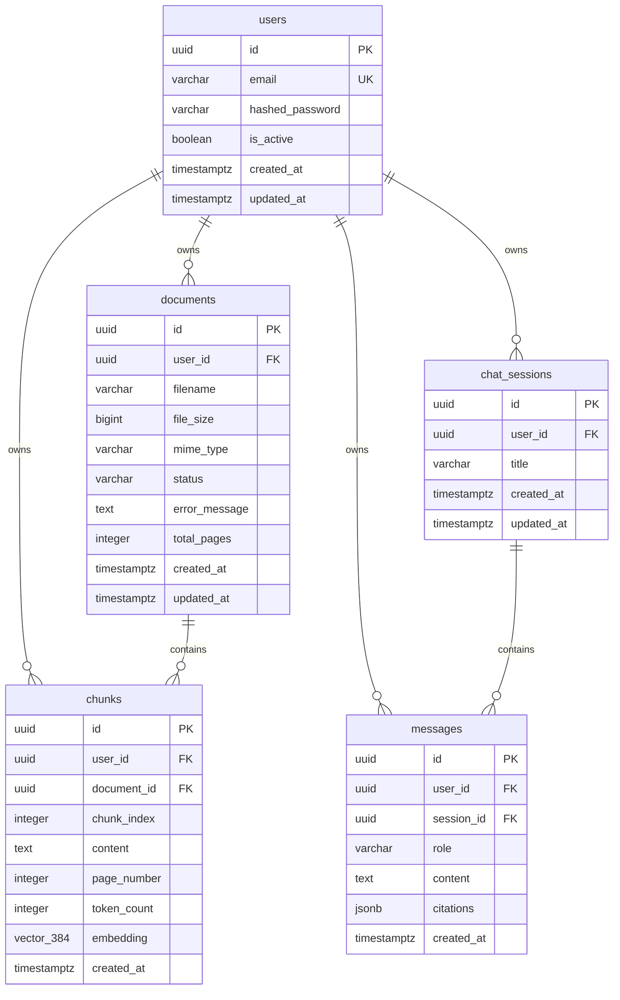

# Data Model Specification: Multi-Tenant Document Q&A Platform

**Feature**: [spec.md](./spec.md) | **Date**: 2026-08-27

---

## Database Schema (PostgreSQL + pgvector)



---

## Table Definitions & Validation Rules

### 1. `users` Table
Stores authenticated tenant identities.

| Column | Type | Constraints | Description |
| :--- | :--- | :--- | :--- |
| `id` | `UUID` | Primary Key, `gen_random_uuid()` | Unique user identifier |
| `email` | `VARCHAR(255)` | Unique, Not Null, Lowercase, Indexed | User login email |
| `hashed_password` | `VARCHAR(255)` | Not Null | Argon2id / bcrypt password hash |
| `is_active` | `BOOLEAN` | Not Null, Default `TRUE` | Account active flag |
| `created_at` | `TIMESTAMPTZ` | Not Null, Default `CURRENT_TIMESTAMP` | Creation timestamp |
| `updated_at` | `TIMESTAMPTZ` | Not Null, Default `CURRENT_TIMESTAMP` | Last updated timestamp |

**Indexes**:
- `ix_users_email` (UNIQUE B-tree on `lower(email)`)

---

### 2. `documents` Table
Stores metadata for files uploaded by a specific user.

| Column | Type | Constraints | Description |
| :--- | :--- | :--- | :--- |
| `id` | `UUID` | Primary Key, `gen_random_uuid()` | Unique document identifier |
| `user_id` | `UUID` | Foreign Key (`users.id` ON DELETE CASCADE), Not Null | Owning tenant identifier |
| `filename` | `VARCHAR(255)` | Not Null | Sanitized original filename |
| `file_size` | `BIGINT` | Not Null, Check `file_size > 0 AND file_size <= 26214400` | Size in bytes (max 25MB) |
| `mime_type` | `VARCHAR(100)` | Not Null, Check `mime_type IN ('application/pdf', 'text/plain')` | Allowed MIME type |
| `status` | `VARCHAR(50)` | Not Null, Default `'uploading'` | Lifecycle: `uploading`, `processing`, `ready`, `failed` |
| `error_message` | `TEXT` | Nullable | Reason for processing failure |
| `total_pages` | `INTEGER` | Nullable | Extracted page count for PDFs |
| `created_at` | `TIMESTAMPTZ` | Not Null, Default `CURRENT_TIMESTAMP` | Upload timestamp |
| `updated_at` | `TIMESTAMPTZ` | Not Null, Default `CURRENT_TIMESTAMP` | Last update timestamp |

**Indexes**:
- `ix_documents_user_id` (B-tree on `user_id`)
- `ix_documents_user_created` (Compound B-tree on `user_id, created_at DESC`)

---

### 3. `chunks` Table
Stores parsed text segments and 384-dimensional dense vectors.

| Column | Type | Constraints | Description |
| :--- | :--- | :--- | :--- |
| `id` | `UUID` | Primary Key, `gen_random_uuid()` | Unique chunk identifier |
| `user_id` | `UUID` | Foreign Key (`users.id` ON DELETE CASCADE), Not Null | Owning tenant identifier |
| `document_id` | `UUID` | Foreign Key (`documents.id` ON DELETE CASCADE), Not Null | Parent document reference |
| `chunk_index` | `INTEGER` | Not Null | 0-indexed order within document |
| `content` | `TEXT` | Not Null | Extracted text chunk (~800 tokens) |
| `page_number` | `INTEGER` | Nullable | Source page number |
| `token_count` | `INTEGER` | Nullable | Estimated token length |
| `embedding` | `vector(384)` | Not Null | Dense embedding from `all-MiniLM-L6-v2` |
| `created_at` | `TIMESTAMPTZ` | Not Null, Default `CURRENT_TIMESTAMP` | Creation timestamp |

**Indexes**:
- `ix_chunks_user_document` (Compound B-tree on `user_id, document_id`)
- `ix_chunks_embedding_hnsw` (HNSW index on `embedding vector_cosine_ops` with `m = 16, ef_construction = 64`)

**Strict Tenant Vector Retrieval Query**:
```sql
SELECT 
    c.id,
    c.document_id,
    d.filename,
    c.page_number,
    c.content,
    1 - (c.embedding <=> :query_vector) AS cosine_similarity
FROM chunks c
JOIN documents d ON d.id = c.document_id
WHERE c.user_id = :current_user_id
  AND d.status = 'ready'
ORDER BY c.embedding <=> :query_vector ASC
LIMIT :top_k;
```

---

### 4. `chat_sessions` Table
Stores distinct conversation threads.

| Column | Type | Constraints | Description |
| :--- | :--- | :--- | :--- |
| `id` | `UUID` | Primary Key, `gen_random_uuid()` | Unique thread identifier |
| `user_id` | `UUID` | Foreign Key (`users.id` ON DELETE CASCADE), Not Null | Owning tenant identifier |
| `title` | `VARCHAR(255)` | Not Null, Default `'New Conversation'` | Thread display title |
| `created_at` | `TIMESTAMPTZ` | Not Null, Default `CURRENT_TIMESTAMP` | Thread creation timestamp |
| `updated_at` | `TIMESTAMPTZ` | Not Null, Default `CURRENT_TIMESTAMP` | Last message timestamp |

**Indexes**:
- `ix_chat_sessions_user_updated` (Compound B-tree on `user_id, updated_at DESC`)

---

### 5. `messages` Table
Stores conversation exchanges and grounding citations.

| Column | Type | Constraints | Description |
| :--- | :--- | :--- | :--- |
| `id` | `UUID` | Primary Key, `gen_random_uuid()` | Unique message identifier |
| `user_id` | `UUID` | Foreign Key (`users.id` ON DELETE CASCADE), Not Null | Owning tenant identifier |
| `session_id` | `UUID` | Foreign Key (`chat_sessions.id` ON DELETE CASCADE), Not Null | Parent thread reference |
| `role` | `VARCHAR(20)` | Not Null, Check `role IN ('user', 'assistant')` | Message sender role |
| `content` | `TEXT` | Not Null | Complete message text |
| `citations` | `JSONB` | Nullable | Structured array of source references |
| `created_at` | `TIMESTAMPTZ` | Not Null, Default `CURRENT_TIMESTAMP` | Message timestamp |

**JSONB Citation Structure**:
```json
[
  {
    "document_id": "8f03c025-a13f-4e08-8f5b-11758ce60172",
    "document_name": "Employee_Contract.pdf",
    "page_number": 4,
    "snippet": "Section 9.2: The contract may be terminated by either party with 30 days notice..."
  }
]
```

**Indexes**:
- `ix_messages_session_created` (Compound B-tree on `user_id, session_id, created_at ASC`)

---

## State Transitions & Invariant Guarantees

### Document Status Lifecycle
```text
[Uploading] ──> [Processing] ──> [Ready]
      │               │
      └──(Error)──────┴───────> [Failed]
```

### Multi-Tenancy Invariants
1. **No Orphan Rows**: All child rows cascading delete with `user_id` removal.
2. **Query Scoping Enforcement**: No database service method may execute without receiving an explicit `user_id: UUID` parameter.
3. **No Cross-Tenant Read/Write**: Any query omitting `user_id` filter is considered a critical bug and barred by architectural linting.
