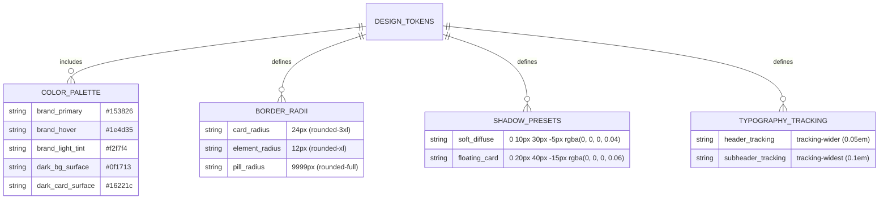

# Phase 1: Data Model & UI State Specification

**Feature**: UI Styling & Visual Polish (`002-ui-styling-polish`)
**Date**: 2026-08-28

---

## 1. UI Design Tokens & Theme Entities



---

## 2. Suggestion Chip Entity Model

The chat empty state introduces 4 interactive suggestion prompts.

```typescript
interface SuggestionChip {
  id: string
  label: string
  iconName: 'FileText' | 'Sparkles' | 'Search' | 'Calendar'
  promptText: string
}
```

### Static Suggestion Chips Definition:

| Chip ID | Label | Icon | Action / Injected Prompt |
| :--- | :--- | :--- | :--- |
| `chip-1` | **Summarize the key points** | `FileText` | *"Summarize the key points of the uploaded documents."* |
| `chip-2` | **What are the main topics?** | `Sparkles` | *"What are the main topics covered in my documents?"* |
| `chip-3` | **Find terms related to...** | `Search` | *"Find key terms and definitions in the documents."* |
| `chip-4` | **List important dates** | `Calendar` | *"List all important dates, deadlines, and milestones mentioned."* |

---

## 3. Responsive Chat Sidebar UI State

```typescript
interface ChatViewResponsiveState {
  isMobileDrawerOpen: boolean // Controls sliding overlay on screens < 768px
  isPasswordVisible: boolean  // Controls password visibility toggle in Auth views
}
```

### State Transitions:

```text
[Mobile Viewport: Screen Width < 768px]
  ├── Initial State: isMobileDrawerOpen = false (Sidebar hidden, hamburger visible)
  ├── User clicks Hamburger Button ──> isMobileDrawerOpen = true (Sidebar slides in, backdrop active)
  ├── User clicks Backdrop Overlay ──> isMobileDrawerOpen = false (Sidebar slides out)
  ├── User selects a Chat Thread ────> isMobileDrawerOpen = false (Sidebar slides out, active thread loaded)
  └── User clicks New Chat ──────────> isMobileDrawerOpen = false (Sidebar slides out, new thread loaded)

[Desktop Viewport: Screen Width >= 768px]
  └── Sidebar remains permanently docked as flex child (w-80), hamburger button hidden
```

---

## 4. Status Badge Variant Model

```typescript
type DocumentProcessingStatus = 'ready' | 'processing' | 'failed'

interface StatusBadgeStyle {
  label: string
  bgClass: string
  textClass: string
  borderClass: string
  dotClass: string
  isPulse: boolean
}
```

### Style Mappings:

| Status | Badge Label | Background & Border Class | Dot Class |
| :--- | :--- | :--- | :--- |
| `ready` | `• Ready` | `bg-emerald-50 text-emerald-700 border-emerald-200/60 dark:bg-emerald-950/50 dark:text-emerald-300 dark:border-emerald-800/50` | `bg-emerald-500 animate-pulse` |
| `processing` | `• Processing` | `bg-amber-50 text-amber-700 border-amber-200/60 dark:bg-amber-950/50 dark:text-amber-300 dark:border-amber-800/50` | `bg-amber-500 animate-spin` |
| `failed` | `• Failed` | `bg-rose-50 text-rose-700 border-rose-200/60 dark:bg-rose-950/50 dark:text-rose-300 dark:border-rose-800/50` | `bg-rose-500` |
