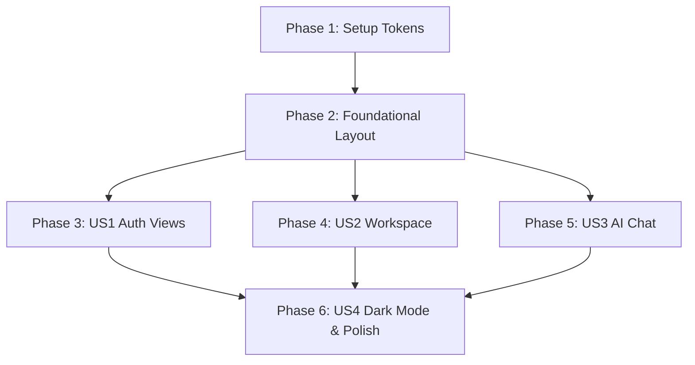

# Tasks: UI Styling & Visual Polish

**Feature**: `002-ui-styling-polish` | **Branch**: `002-ui-styling-polish` | **Spec**: [specs/002-ui-styling-polish/spec.md](spec.md) | **Plan**: [specs/002-ui-styling-polish/plan.md](plan.md)

---

## Phase 1: Setup (Global Design Tokens & Configuration)

**Purpose**: Update global stylesheets and Tailwind configuration with brand colors, typography tracking, border radii, and soft diffuse drop shadows.

- [x] T001 Update Tailwind configuration with `#153826` forest green brand tokens, 24px border radii (`rounded-3xl` / `rounded-[24px]`), letter-spacing tracking, and diffuse shadow presets in `frontend/tailwind.config.js`
- [x] T002 [P] Update global stylesheet with ambient shadow variables, root typography smoothing, and custom scrollbar styling in `frontend/src/assets/main.css`

---

## Phase 2: Foundational (Layout & Shared Components)

**Purpose**: Update shared layout and badge components that all application views depend on.

**⚠️ CRITICAL**: Foundational components establish the global visual shell before view-level refactoring.

- [x] T003 [P] Update `StatusBadge.vue` to include active pulsating status dots (`• Ready`, `• Processing`, `• Failed`) and theme-aware soft background fills in `frontend/src/components/common/StatusBadge.vue`
- [x] T004 [P] Update `Modal.vue` with rounded-3xl container, frosted backdrop blur overlay, and smooth scale entrance animation in `frontend/src/components/common/Modal.vue`
- [x] T005 [P] Update `AppNavbar.vue` with deep green brand logo, "Tenant Isolated" outline pill badge, active tab bottom border indicator (`border-b-2 border-[#153826]`), and user profile dropdown styling in `frontend/src/components/layout/AppNavbar.vue`

**Checkpoint**: Foundation ready - view-level user stories can now proceed in parallel.

---

## Phase 3: User Story 1 - Premium Authentication Views (Priority: P1) 🎯 MVP

**Goal**: Refactor Login and Signup into 2-column split responsive layouts with 3 benefit feature highlights and floating 24px rounded form cards.

**Independent Test**: Navigate to `/login` and `/register` on mobile and desktop, verifying input icon adornments (`Mail`, `Lock`, `Eye`), button hover states, and error alerts without breaking authentication submission logic.

### Implementation for User Story 1

- [x] T006 [P] [US1] Refactor `LoginView.vue` with 2-column layout (left value props: Secure & Private, AI-Powered Q&A, Smart Retrieval; right 24px card with Mail/Lock icons, password visibility toggle, and dark green submit CTA) in `frontend/src/views/LoginView.vue`
- [x] T007 [P] [US1] Refactor `RegisterView.vue` with 2-column layout (left value props: Upload & Manage, Ask with Confidence, Always Private; right 24px card with Mail/Lock icons, password visibility toggle, and dark green CTA) in `frontend/src/views/RegisterView.vue`

**Checkpoint**: User Story 1 complete - Login and Signup views match reference design in light and dark modes.

---

## Phase 4: User Story 2 - Modern & Responsive Document Workspace (Priority: P1)

**Goal**: Refactor Document Workspace with header upload action, tinted soft dashed dropzone, and responsive data table with tracked uppercase headers and horizontal scroll.

**Independent Test**: View Document Workspace, drag/hover files in dropzone, inspect data table headers and status dots, test horizontal scroll on mobile viewport (<768px).

### Implementation for User Story 2

- [x] T008 [P] [US2] Refactor `DragDropZone.vue` with soft dashed border, subtle light/dark background tint, 24px corner radius, and active drag state scaling in `frontend/src/components/documents/DragDropZone.vue`
- [x] T009 [P] [US2] Refactor `DocumentGrid.vue` with tracked uppercase headers (`FILE NAME`, `DOCUMENT ID`, etc.), PDF badge indicators, copy Document ID pill, and responsive horizontal scroll wrapper in `frontend/src/components/documents/DocumentGrid.vue`
- [x] T010 [P] [US2] Refactor `DeleteDocModal.vue` with polished danger modal layout and theme styling in `frontend/src/components/documents/DeleteDocModal.vue`
- [x] T011 [US2] Update `DocumentsView.vue` layout with header "+ Upload Documents" primary button and responsive spacing in `frontend/src/views/DocumentsView.vue`

**Checkpoint**: User Story 2 complete - Document Workspace features polished dropzone and responsive data table.

---

## Phase 5: User Story 3 - Responsive AI Chat Experience with Mobile Drawer (Priority: P1)

**Goal**: Refactor AI Chat interface with reduced sidebar weight, interactive empty-state suggestion chips (2x2 grid), floating chat input bar, and collapsible mobile sidebar drawer.

**Independent Test**: On mobile viewport (<768px), verify hamburger menu opens/closes sidebar drawer. On empty chat, verify clicking any of the 4 suggestion chips triggers the query. Verify floating chat input and streaming message bubbles.

### Implementation for User Story 3

- [x] T012 [P] [US3] Refactor `ChatSidebar.vue` with solid `#153826` "New Chat" button, lighter "Clear Context" button, tracked uppercase headers, and persistent "Strict Privacy Sandbox" footer in `frontend/src/components/chat/ChatSidebar.vue`
- [x] T013 [P] [US3] Refactor `ChatWindow.vue` with empty state header, 4 interactive suggestion chips (2x2 grid), and floating input container with diffuse shadow and dark green submit button in `frontend/src/components/chat/ChatWindow.vue`
- [x] T014 [P] [US3] Refactor `MessageBubble.vue` and `CitationPill.vue` with polished user/assistant bubbles, clean markdown typography, and compact citation pills in `frontend/src/components/chat/MessageBubble.vue` and `frontend/src/components/chat/CitationPill.vue`
- [x] T015 [US3] Update `ChatView.vue` with mobile responsive header, hamburger menu toggle, and collapsible sidebar drawer overlay backdrop in `frontend/src/views/ChatView.vue`

**Checkpoint**: User Story 3 complete - AI Chat view has 2x2 suggestion chips, floating input, and collapsible mobile drawer.

---

## Phase 6: User Story 4 (P2) & Polish - Comprehensive Dark Mode & Build Validation

**Purpose**: Cross-cutting theme parity review, build verification, and end-to-end smoke testing.

- [x] T016 [P] [US4] Audit and refine `dark:` classes across all views and modals for deep neutral contrast and soft luminescence in `frontend/src/views` and `frontend/src/components`
- [x] T017 Run TypeScript check and Vite production build (`npm run build`) in `frontend` to verify 0 syntax or template errors
- [x] T018 Execute visual regression and end-to-end user journey validation per `specs/002-ui-styling-polish/quickstart.md`

---

## Dependencies & Execution Order

### Phase Dependencies

### User Story Dependencies

- **User Story 1 (P1)**: Independent after Phase 2 (Foundational).
- **User Story 2 (P1)**: Independent after Phase 2 (Foundational).
- **User Story 3 (P1)**: Independent after Phase 2 (Foundational).
- **User Story 4 (P2)**: Verifies cross-cutting dark mode styling across US1, US2, and US3.

---

## Parallel Execution Opportunities

- **Phase 1**: `T001` (Tailwind config) and `T002` (main.css) can run in parallel.
- **Phase 2**: `T003` (StatusBadge), `T004` (Modal), and `T005` (Navbar) can run in parallel.
- **Phase 3**: `T006` (LoginView) and `T007` (RegisterView) can run in parallel.
- **Phase 4**: `T008` (DragDropZone), `T009` (DocumentGrid), and `T010` (DeleteDocModal) can run in parallel.
- **Phase 5**: `T012` (ChatSidebar), `T013` (ChatWindow), and `T014` (MessageBubble) can run in parallel.

---

## Implementation Strategy

### MVP First (Authentication & Foundation)
1. Complete Phase 1 (Tokens) and Phase 2 (Foundational Layout & Badges).
2. Complete Phase 3 (User Story 1 Auth Views).
3. Validate `/login` and `/register` visually on desktop and mobile.

### Incremental Delivery
1. Add Phase 4 (User Story 2 Document Workspace) → Verify Dropzone & Data Table.
2. Add Phase 5 (User Story 3 AI Chat) → Verify Suggestion Chips & Mobile Drawer.
3. Add Phase 6 (Theme Audit & Build Check) → Complete feature validation.
