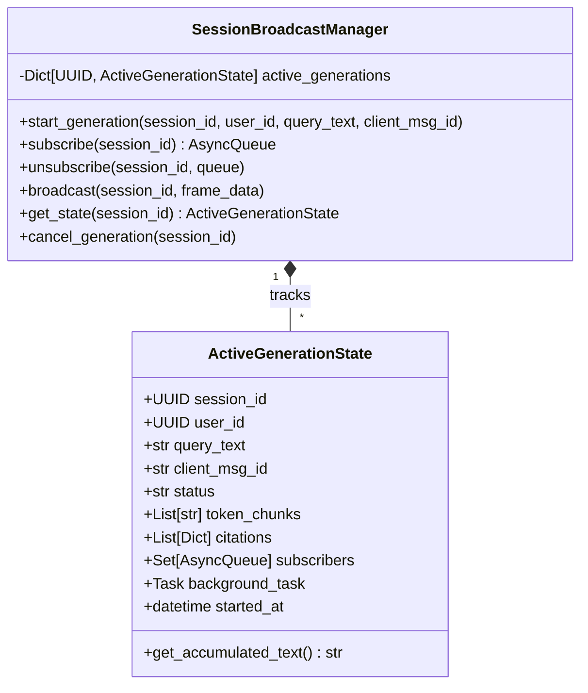

# Phase 1: Data Model & Pub/Sub Architecture

**Feature**: Asynchronous Background Streaming & Resilient Reconnection (`003-async-streaming-resilience`)
**Date**: 2026-08-28

---

## 1. Backend In-Memory Pub/Sub State Model



---

## 2. Session Sync REST Schema

```python
class SessionSyncResponse(BaseModel):
    session_id: uuid.UUID
    is_generating: bool
    status_step: Optional[str] = None # 'searching_documents', 'generating', 'idle'
    status_message: Optional[str] = None
    accumulated_content: Optional[str] = None
    latest_message_id: Optional[uuid.UUID] = None
    last_updated: datetime
```

---

## 3. Frontend Reactive Network State

```typescript
interface NetworkStatusState {
  isOnline: boolean
  isReconnecting: boolean
  offlineSince: Date | null
  reconnectAttempts: number
}
```
