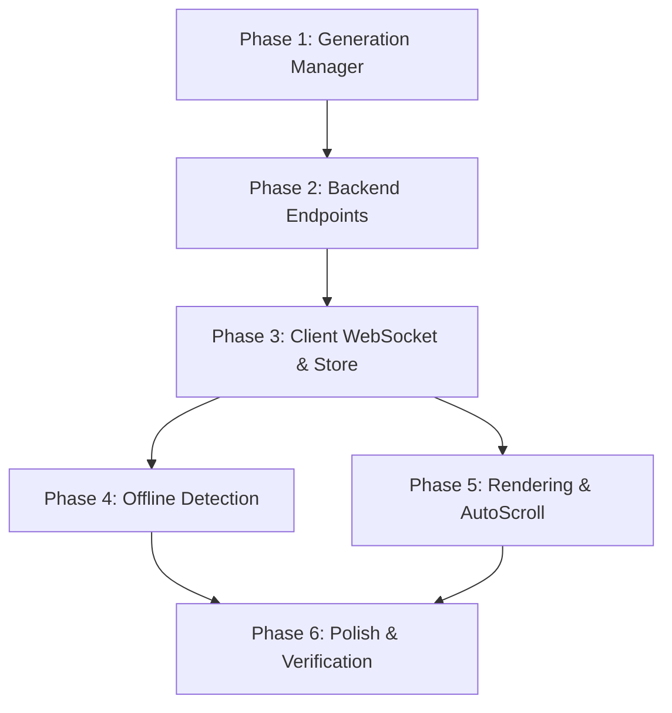

# Tasks: Asynchronous Background Streaming & Resilient Reconnection

**Feature**: `003-async-streaming-resilience` | **Branch**: `003-async-streaming-resilience` | **Spec**: [specs/003-async-streaming-resilience/spec.md](spec.md) | **Plan**: [specs/003-async-streaming-resilience/plan.md](plan.md)

---

## Phase 1: Setup (Backend Pub/Sub & Generation Manager)

**Purpose**: Create in-memory SessionBroadcastManager that decouples LLM generation from client sockets.

- [ ] T001 Implement `SessionBroadcastManager` in `backend/src/services/generation_manager.py` with `asyncio.create_task` background worker, subscriber queues, and token catch-up buffer

---

## Phase 2: Foundational (Backend Endpoints & Handlers)

**Purpose**: Refactor WebSocket and REST endpoints to use the decoupled broadcast manager.

**⚠️ CRITICAL**: Foundational backend decoupling must be in place before client hook integration.

- [ ] T002 Refactor `websocket_chat_endpoint` in `backend/src/api/v1/websocket.py` to act as a pub/sub subscriber consuming from `SessionBroadcastManager` with catch-up streaming
- [ ] T003 [P] Add session sync endpoint `GET /api/v1/chat/sessions/{session_id}/sync` in `backend/src/api/v1/chat.py` returning active generation status, buffer, and message state

**Checkpoint**: Backend decoupling ready - client WebSocket and offline state handlers can now be built.

---

## Phase 3: User Story 1 & 2 - Resilient Client WebSocket Hook & Optimistic UI (Priority: P1) 🎯 MVP

**Goal**: Enable seamless client reconnection with exponential backoff, catch-up buffering, and optimistic message rendering.

**Independent Test**: Disconnect network mid-stream, re-enable after 3 seconds, and verify socket reconnects and resumes streaming without token loss.

### Implementation for User Story 1 & 2

- [ ] T004 [P] [US1] Implement exponential backoff with jitter, ping/pong heartbeat, and catch-up buffer handler in `frontend/src/composables/useChatWebSocket.ts`
- [ ] T005 [P] [US2] Update `chat.ts` store with optimistic user message rendering, streaming token buffer append, and message deduplication in `frontend/src/stores/chat.ts`

**Checkpoint**: User Stories 1 & 2 complete - background generation and reconnection catch-up work reliably.

---

## Phase 4: User Story 3 - Offline State Detection & Reconnection Banner (Priority: P2)

**Goal**: Display an immediate global banner when the device loses network connectivity.

**Independent Test**: Toggle offline mode in browser DevTools and verify the "You are disconnected" banner appears immediately.

### Implementation for User Story 3

- [ ] T006 [P] [US3] Create `useNetworkStatus.ts` composable tracking `navigator.onLine` and `online`/`offline` window events in `frontend/src/composables/useNetworkStatus.ts`
- [ ] T007 [US3] Integrate network status banner with reconnection status and auto-dismiss in `frontend/src/views/ChatView.vue`

**Checkpoint**: User Story 3 complete - offline network states are clearly communicated to the user.

---

## Phase 5: User Story 4 - Performant Token Rendering & Smooth Auto-Scrolling (Priority: P2)

**Goal**: Eliminate DOM layout thrashing and prevent disruptive auto-scrolling when users read earlier messages.

**Independent Test**: Stream a dense response while scrolling up and verify scrolling locks in place comfortably.

### Implementation for User Story 4

- [ ] T008 [P] [US4] Refactor `useAutoScroll.ts` with user-scroll detection threshold (locks auto-scroll when user is scrolled up) in `frontend/src/composables/useAutoScroll.ts`
- [ ] T009 [US4] Update `ChatWindow.vue` with `requestAnimationFrame` token batching buffer and bottom anchor scroll in `frontend/src/components/chat/ChatWindow.vue`

**Checkpoint**: User Story 4 complete - 60fps smooth rendering and user-friendly scrolling during rapid token streams.

---

## Phase 6: Polish & Verification

**Purpose**: Automated validation and end-to-end resilience verification.

- [ ] T010 [P] Run backend syntax verification and frontend production build (`npm run build`) in `frontend`
- [ ] T011 Execute verification scenarios per `specs/003-async-streaming-resilience/quickstart.md`

---

## Dependencies & Execution Order

### Phase Dependencies

---

## Implementation Strategy

### MVP First (Background Generation & Reconnection)
1. Implement Phase 1 (`generation_manager.py`) and Phase 2 (`websocket.py`).
2. Implement Phase 3 (`useChatWebSocket.ts` + `chat.ts` store).
3. Test disconnect and reconnect catch-up mid-stream.

### Incremental Delivery
1. Add Phase 4 (`useNetworkStatus.ts` + Offline Banner).
2. Add Phase 5 (`requestAnimationFrame` batching + scroll-lock in `useAutoScroll.ts`).
3. Complete Phase 6 (Build & validation).
