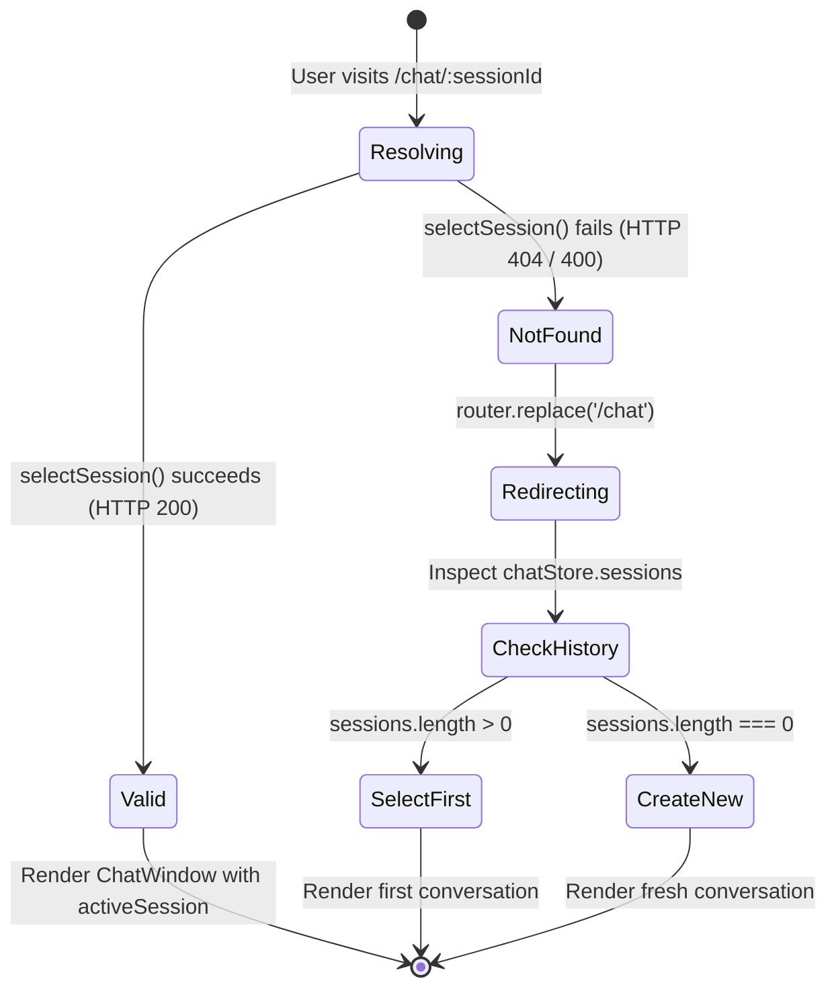

# Data Model & State Specifications

**Feature Branch**: `004-mobile-ux-session-upload` | **Date**: 2026-08-29

---

## 1. Client State & Entities

### Chat Session Fallback Model (`SessionFallbackState`)
Represents the lifecycle of resolving a chat session requested via URL parameter or route transition.

| Field | Type | Description |
|---|---|---|
| `requestedSessionId` | `string` | UUID parsed from `/chat/:sessionId` route parameter |
| `status` | `'resolving' \| 'valid' \| 'not_found' \| 'error'` | Current verification state of the requested session |
| `targetRedirect` | `string` | Destination route (`/chat`) if verification fails |
| `recoveryAction` | `'select_default' \| 'create_new'` | Strategy used to initialize chat state after 404 fallback |

#### State Transitions:


---

### Mobile Navigation Model (`MobileNavigationItem`)
Defines the schema for touch-friendly mobile bottom tab bar items.

| Field | Type | Description |
|---|---|---|
| `id` | `string` | Unique identifier (`'documents'`, `'chat'`) |
| `label` | `string` | Human-readable label ('Documents', 'AI Chat') |
| `path` | `string` | Target Vue Router route (`/documents`, `/chat`) |
| `icon` | `Component` | Lucide icon component (`FolderClosed`, `MessageSquare`) |
| `activeCondition` | `(currentPath: string) => boolean` | Predicate function matching active tab state |
| `requiresAuth` | `boolean` | Must be `true` to display in authenticated tab bar |

---

### Normalized File Model (`NormalizedUploadFile`)
Encapsulates mobile-safe file validation and MIME normalization before `FormData` serialization.

| Field | Type | Validation Rule | Normalization |
|---|---|---|---|
| `rawFile` | `File` | Native browser file object | Unmodified binary payload |
| `name` | `string` | Must not be empty, must have extension | Preserved as `file.name` |
| `extension` | `'pdf' \| 'txt' \| 'md'` | Extracted lowercase: `name.split('.').pop()` | Must match allowed whitelist |
| `size` | `number` | `0 < size <= 25 * 1024 * 1024` (25MB) | Rejected if 0 or > 25MB |
| `mimeType` | `string` | Standard MIME string | If generic (`application/octet-stream` or `""`), mapped to canonical MIME |

#### MIME Normalization Mapping:
```typescript
export const CANONICAL_MIME_TYPES: Record<string, string> = {
  pdf: 'application/pdf',
  txt: 'text/plain',
  md: 'text/markdown',
}
```

---

## 2. Pinia Store Contracts

### Updated `useChatStore` Interface
```typescript
interface ChatStore {
  // State
  sessions: Ref<ChatSession[]>
  activeSession: Ref<ChatSession | null>
  isLoadingSessions: Ref<boolean>
  isLoadingActiveSession: Ref<boolean>
  isStreaming: Ref<boolean>
  streamingContent: Ref<string>
  activeMessages: ComputedRef<Message[]>

  // Actions
  fetchSessions: () => Promise<void>
  createNewSession: (title?: string) => Promise<ChatSession | null>
  selectSession: (sessionId: string) => Promise<boolean> // Returns true if found, false if 404/error
  updateSessionTitle: (sessionId: string, newTitle: string) => Promise<void>
  deleteSession: (sessionId: string) => Promise<void>
  addOptimisticUserMessage: (text: string, clientMsgId: string) => void
  appendStreamingToken: (token: string) => void
  finalizeStreamingMessage: (payload: any) => void
  clearContext: () => void
}
```
